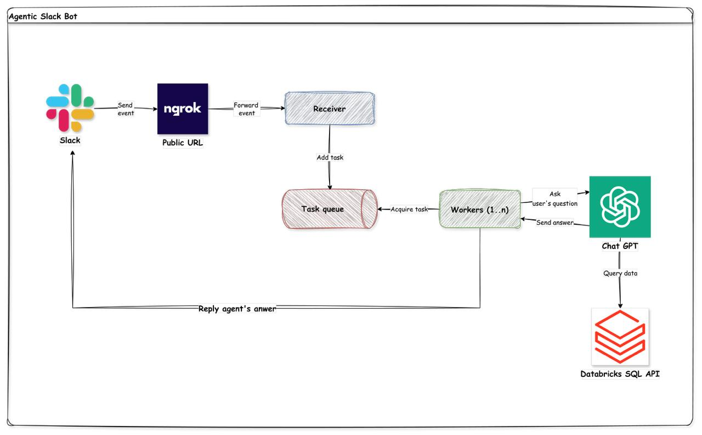

# Databricks Assistant — Slack Bot

An agentic Slack bot that answers questions about your Databricks data infrastructure — catalogs, schemas, tables, columns, jobs, lineage, query history, usage costs, and data access control.

Powered by OpenAI with function calling. A lightweight router model selects only the relevant skill context for each question; the main model then queries Databricks system tables on demand and replies in-thread with full conversation context.

## Architecture



## What it can answer

- How many catalogs / schemas / tables exist, and their column definitions
- Databricks job configs, schedules, task dependencies, and run history
- Data lineage — upstream and downstream table dependencies
- Query execution history — who ran what, when, duration, status
- Platform DBU consumption and estimated cost by workspace, SKU, or user
- Data access control — which tables a user can see, which users can access a table

Questions about business data values (revenue, customer counts, etc.) are out of scope and politely declined.

Data window: **last 180 days** for all event and history tables.

## Setup

### 1. Fill in `.env`

```bash
cp .env.example .env
# Fill in all values
```

Set `WORKER_COUNT` to the number of concurrent workers you want (default: `4`).

### 2. Start services

```bash
docker compose up --build
```

### 3. Finish Slack setup

Open http://localhost:4040 → copy the `https://...ngrok-free.app` URL.

Back in Slack app config:
- **Event Subscriptions** → toggle **On**
- **Request URL**: `https://<your-ngrok>.ngrok-free.app/slack/events`
- Slack pings the URL; receiver responds to the challenge → ✅ Verified
- **Subscribe to bot events** → add `app_mention`
- **Save Changes** → reinstall the app if prompted.

### 4. Test

Invite the bot to a channel: `/invite @yourbot`

Try asking:
```
@yourbot how many tables are in the gold schema?
@yourbot show me failed job runs in the last 7 days
@yourbot which jobs cost the most last month?
@yourbot what tables can alice@example.com access?
```

Follow-up questions work — the bot remembers the thread conversation for 24 hours.

## Scaling workers

Set `WORKER_COUNT` in `.env` and restart:

```bash
docker compose up -d
```

Each worker container handles one question at a time. Redis distributes jobs to the first free worker (competing-consumer), so load is spread evenly without any round-robin configuration.

## Updating agent instructions

Instructions live in [`src/worker/skills/`](src/worker/skills/) as individual Markdown files — no code changes or image rebuild needed for edits in most cases.

| File | Purpose | Always loaded |
|---|---|---|
| `01_core.md` | Identity, scope, query rules | Yes |
| `02_filters.md` | Mandatory catalog/time scope filters | Yes |
| `03_metadata.md` | `information_schema` tables | Routed |
| `04_jobs.md` | Lakeflow jobs and run timelines | Routed |
| `05_lineage.md` | `access.table_lineage` | Routed |
| `06_billing.md` | Billing usage and query history | Routed |
| `07_access.md` | Data access control tables | Routed |
| `08_formatting.md` | Slack output formatting rules | Yes |

**Always-loaded** skills are included in every system prompt. **Routed** skills are selected per-request by a fast router model (`gpt-4o-mini` by default) based on the user's question and recent conversation history.

### Adding a new skill

Create a numbered `.md` file in `src/worker/skills/` with this frontmatter:

```markdown
---
name: my-skill
always: false
description: Use when the question is about X, Y, or Z.
---

## Skill: My Skill

...content...
```

The router uses the `description` field to decide when to load it. Set `always: true` to load it on every request regardless.

## Optional environment variables

| Variable | Default | Description |
|---|---|---|
| `WORKER_COUNT` | `4` | Number of concurrent worker containers |
| `ROUTER_MODEL` | `gpt-4o-mini` | Model used for skill routing (cheap, fast) |
