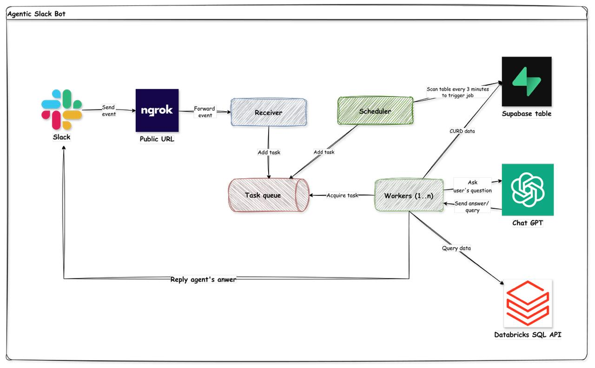

# Agentic Slack Bot

An agentic Slack bot that answers questions about your Databricks data infrastructure — catalogs, schemas, tables, columns, jobs, lineage, query history, usage costs, and data access control.

Powered by OpenAI with function calling. A lightweight router model selects only the relevant skill context for each question; the main model then queries Databricks system tables on demand and replies in-thread with full conversation context.

Multiple independent bots (one per Slack workspace or use-case) are supported. All bot credentials and configuration live in a `bots` table in Supabase — no per-bot env vars needed.

## Architecture



## Services

| Service | Responsibility |
|---|---|
| **receiver** | FastAPI app that accepts incoming Slack webhook events. Resolves the bot by Slack `team_id` from Supabase, verifies the per-bot HMAC-SHA256 signature, deduplicates events via Redis, and enqueues `app_mention` payloads onto the `slack_events` RQ queue. |
| **worker** | RQ consumer that processes queued Slack events. Loads per-bot config (token, skills, admin users) from Supabase, runs the OpenAI agent loop, executes Databricks SQL queries, fetches job run error details, manages scheduled questions, and posts replies back to Slack threads. Scales horizontally via `WORKER_COUNT`. |
| **scheduler** | Background loop that polls Supabase every `SCHEDULER_INTERVAL` seconds. Evaluates each saved cron schedule against the current time and enqueues `process_scheduled_question` jobs for any that are due, passing the schedule's `bot_id` so the correct bot posts the answer. |
| **redis** | Message broker and deduplication store. Distributes jobs between workers (competing-consumer), tracks seen Slack event IDs, and records per-schedule last-fired timestamps. |
| **ngrok** | Tunnels `receiver:8123` to a public HTTPS URL so Slack can reach the bot during local development. |

## Modules

| Module | Responsibility |
|---|---|
| `src/receiver/` | Slack webhook handler — per-bot signature verification, URL challenge, event deduplication, and RQ enqueue. |
| `src/worker/` | Agent core — OpenAI function-calling loop, skill loading and routing, tool dispatch (SQL, job details, schedule CRUD), and thread history management. |
| `src/scheduler/` | Cron scheduler — reads schedules from Supabase, evaluates firing windows, and enqueues periodic questions per bot. |
| `src/connectors/bots.py` | Bot registry — loads `BotConfig` (token, signing secret, enabled skills, admin users) from the Supabase `bots` table by workspace ID or bot ID. |
| `src/connectors/databricks.py` | Databricks clients — Statement API (SQL queries) and Jobs REST API (run details). |
| `src/connectors/postgres.py` | Supabase clients — schedule CRUD. |
| `src/worker/skills/` | Markdown skill files loaded into the agent system prompt. The router selects which skills to include based on the user's question. |
| `src/databricks/metric_views/` | SQL view definitions for the semantic layer (`vw_dbu_cost`, `vw_job_run_stats`, `vw_query_perf`) deployed to `vireox_infra.semantic` in Databricks. |

## What it can answer

- How many catalogs / schemas / tables exist, and their column definitions
- Databricks job configs, schedules, task dependencies, and run history (including per-task error details)
- Data lineage — upstream and downstream table dependencies
- Query execution history — who ran what, when, duration, status
- Platform DBU consumption and estimated cost by workspace, SKU, or user
- Data access control — which tables a user can see, which users can access a table
- Aggregated metrics via semantic views — cost trends, job success/failure rates, query performance stats
- Scheduled reports — list, create, update, and remove cron-based automated questions (admin-only)

Questions about business data values (revenue, customer counts, etc.) are out of scope and politely declined.

Data window: **last 180 days** for all event and history tables.

## Setup

### 1. Create the database tables

Run [`src/migrations/001_multi_bot.sql`](src/migrations/001_multi_bot.sql) against your Supabase database to create the `bots` table and add `bot_id` to the `schedules` table.

### 2. Register your bot in Supabase

Insert one row per Slack app into the `bots` table:

```sql
INSERT INTO bots (id, bot_token, signing_secret, enabled_skills, admin_users, workspace_id)
VALUES (
  'my-bot',                          -- unique slug
  'xoxb-...',                        -- OAuth bot token from Slack app config
  'your_signing_secret',             -- signing secret from Slack app config
  '{}',                              -- empty = all skills; or e.g. '{"jobs","billing"}'
  ARRAY['U08UQ1FG39S'],              -- Slack user IDs allowed to manage schedules
  'T08FGJLPELA'                      -- Slack workspace ID (team_id)
);
```

- **Bot token** and **signing secret**: Slack app config → Basic Information / OAuth & Permissions
- **Workspace ID**: shown as `team_id` in any Slack event payload, or visible in your Slack workspace URL

### 3. Fill in `.env`

```bash
cp .env.example .env
# Fill in SUPABASE_DB_URL, OPENAI_API_KEY, DATABRICKS_*, NGROK_AUTHTOKEN
```

### 4. Start services

```bash
docker compose up --build
```

### 5. Finish Slack setup

Open http://localhost:4040 → copy the `https://...ngrok-free.app` URL.

Back in Slack app config:
- **Event Subscriptions** → toggle **On**
- **Request URL**: `https://<your-ngrok>.ngrok-free.app/slack/events`
- Slack pings the URL; receiver responds to the challenge → ✅ Verified
- **Subscribe to bot events** → add `app_mention`
- **Save Changes** → reinstall the app if prompted.

### 6. Test

Invite the bot to a channel: `/invite @yourbot`

Try asking:
```
@yourbot how many tables are in the gold schema?
@yourbot show me failed job runs in the last 7 days
@yourbot which jobs cost the most last month?
@yourbot what tables can alice@example.com access?
@yourbot what is the p95 job duration for the ingestion pipeline?
```

Follow-up questions work — the bot remembers the thread conversation for 24 hours.

## Adding a second bot

1. Create a second Slack app at https://api.slack.com/apps
2. Insert another row into the `bots` table with its token, signing secret, and workspace ID
3. No deployment changes needed — the receiver resolves bots dynamically at runtime

Each bot can have its own `enabled_skills` (to restrict what it can answer) and `admin_users` (to control who can manage its schedules).

## Scaling workers

Set `WORKER_COUNT` in `.env` and restart:

```bash
docker compose up -d
```

Each worker container handles one question at a time. Redis distributes jobs to the first free worker (competing-consumer), so load is spread evenly without any round-robin configuration.

## Updating agent instructions

Instructions live in [`src/worker/skills/`](src/worker/skills/) as individual Markdown files — no code changes or image rebuild needed for edits in most cases.

| File | Purpose | Always loaded |
|---|---|---|
| `01_core.md` | Identity, scope, query rules | Yes |
| `02_filters.md` | Mandatory catalog/time scope filters | Yes |
| `03_metadata.md` | `information_schema` tables | Routed |
| `04_jobs.md` | Lakeflow jobs and run timelines | Routed |
| `05_lineage.md` | `access.table_lineage` | Routed |
| `06_billing.md` | Raw billing and query history tables | Routed |
| `07_access.md` | Data access control tables | Routed |
| `08_formatting.md` | Slack output formatting rules | Yes |
| `09_schedules.md` | Scheduled report management (admin) | Routed |
| `10_semantic.md` | Semantic views for aggregated metrics | Routed |

**Always-loaded** skills are included in every system prompt. **Routed** skills are selected per-request by a fast router model (`gpt-4o-mini` by default) based on the user's question and recent conversation history.

### Adding a new skill

Create a numbered `.md` file in `src/worker/skills/` with this frontmatter:

```markdown
---
name: my-skill
always: false
description: Use when the question is about X, Y, or Z.
---

## Skill: My Skill

...content...
```

The router uses the `description` field to decide when to load it. Set `always: true` to load it on every request regardless.

To restrict a skill to specific bots, set `enabled_skills` on the bot's row in Supabase. An empty array means all skills are available.

## Environment variables

| Variable | Required | Description |
|---|---|---|
| `SUPABASE_DB_URL` | Yes | PostgreSQL connection string for Supabase |
| `OPENAI_API_KEY` | Yes | OpenAI API key |
| `DATABRICKS_HOST` | Yes | Databricks workspace URL |
| `DATABRICKS_WAREHOUSE_ID` | Yes | SQL warehouse ID for statement execution |
| `DATABRICKS_ACCESS_TOKEN` | Yes | Databricks personal access token |
| `NGROK_AUTHTOKEN` | Yes | ngrok auth token (local dev only) |
| `WORKER_COUNT` | No | Number of concurrent worker containers (default: `2`) |
| `ROUTER_MODEL` | No | Model used for skill routing (default: `gpt-4o-mini`) |
| `SCHEDULER_INTERVAL` | No | Seconds between scheduler polling ticks (default: `180`) |
