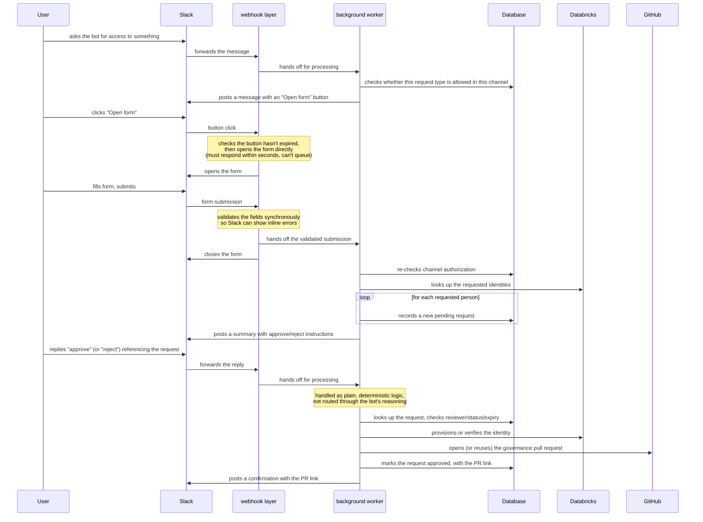
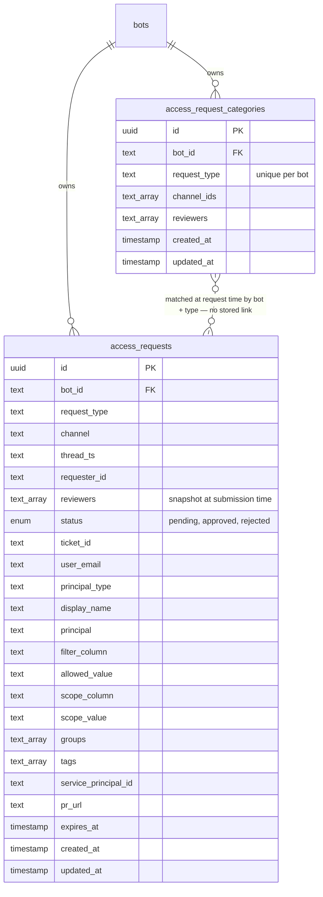

# **Data Access Request Form**

*Slack-native workflow for requesting, approving, and provisioning row-filter access to Databricks Unity Catalog data*

| Authors | hung@100xteam.ai |
| --- | --- |
| Status | `ADOPTED` |
| PRD Link | — |
| Slack | #data-access-requests |
| Date | 2026-09-12 |

# **Overview**

The data access request form lets a user request row-filter (or tag-scoped) access to Databricks data directly from a Slack conversation with the bot, without leaving Slack or filing a ticket by hand. The bot opens a form to collect the request details, validates and records the request, and — once a designated reviewer approves it — provisions the underlying identity in Databricks, appends the access rule to the data platform's governance configuration, and opens a pull request for sign-off.

This document describes the current implementation: the request form, the split between the always-on webhook layer and the background worker that handles it, the records that back it, and the review/approval flow that turns an approved request into a pull request.

# **Business Impact**

- Removes the manual, ticket-driven process for requesting row-level data access, cutting turnaround time from days to minutes.
- Keeps access grants auditable: every request and its resolution is a durable, timestamped record, and every approval produces a traceable pull request against the governance configuration.
- Reviewer authorization is scoped per request category (per Slack channel), so different data domains can have different reviewers without any code change — configured entirely as data.

# **Goals**

- Let any user request access to a defined category of data (today, row-filter access to a table) from within a Slack thread.
- Ensure only designated reviewers can approve or reject a request, and only for categories authorized in the channel where it was requested.
- Provision the underlying Databricks identity (a service principal or a user) and the corresponding governance pull request automatically on approval — no manual configuration editing.
- Keep the always-on webhook layer free of business logic, with only two narrowly-scoped, documented exceptions needed to satisfy Slack's own timing constraints.

# **Requirements**

- Must not require the requester to be an admin or otherwise whitelisted — any user in an authorized channel can start a request.
- Form field validation (email format, one email per line) must happen synchronously, so Slack can show inline form errors before the form closes.
- Channel-to-category authorization must be re-checked at every stage (button click, submission, approval), since that mapping can change between steps.
- A submission requesting multiple people must produce one independent request per person, so each can be reviewed and approved on its own.
- Approval must be safe to retry — re-approving an already-approved request must never duplicate the resulting pull request or its contents.
- The reviewer identity check must use the reviewer list captured for that specific request category, not the bot's general admin list — these are deliberately separate concepts.
- Requests must expire (24 hours) and an unopened form button must expire independently (1 hour), and both must be enforced without relying on the user not clicking late.

# Solution

## High-Level Flow

## Entry Point 1 — Requesting Access

- A user asks the bot for access in a Slack thread; the bot recognizes this as a data-access request.
- The bot checks whether the requested category is authorized for the channel it was asked in — if not, it declines politely with no side effects.
- If authorized, it posts a message with a button. The button carries just enough context (which category, which channel/thread, who asked, who the eligible reviewers are, and an expiry) to open the right form later — nothing is recorded as a request yet.

## Entry Point 2 — Opening the Form

- Handled directly by the always-on webhook layer — one of two narrowly-scoped exceptions to "the webhook layer contains no business logic," because Slack requires the form to open within a few seconds of the button click, a latency guarantee an asynchronous background queue can't reliably provide.
- The webhook layer checks the button's expiry, attributes the request to whoever actually clicked it (not necessarily who it was originally posted for), and builds the form — no other lookups happen at this point.

## Form Fields

| Field | Type | Notes |
| --- | --- | --- |
| Ticket ID | free text | Used in the resulting PR title |
| User email(s) | free text (multiline) | One per line, no commas |
| Filter column | dropdown | e.g. location, location market |
| Allowed value | dropdown | "ALL" or a specific location |
| Scope column | dropdown | e.g. company |
| Scope value | dropdown | One of the company's business units/domains |
| Principal type | dropdown | Currently only "Service principal" |
| Groups | multi-select | Groups to add the identity to |
| Tags | multi-select | Governance tags |

## Submission Validation

- Form submission is also handled synchronously by the webhook layer — the second documented exception — because Slack requires field-level errors to come back on the submission response itself, before the form closes; a delayed reply from the background worker would arrive after the form is already gone.
- Validation itself is simple and self-contained: it parses and deduplicates the submitted emails, rejects comma-separated entries (one per line is required), and checks each against a standard email format. Any problems are returned as inline, per-field errors.
- On success, the webhook layer hands the validated submission to the background worker and closes the form.

## Worker Processing

Once handed off, the background worker:

1. Re-checks channel authorization — the category may have changed since the button was first posted.
2. Performs one batched identity lookup in Databricks for all requested emails together (rather than one lookup per person), to stay well within its processing time budget.
3. Creates one independent request record per requested person, each carrying the shared form details plus its own resolved identity.
4. Posts a single Slack message summarizing everything that was created, including approve/reject instructions addressed to that category's reviewers.

## Review & Approval

Approval and rejection are handled as plain, deterministic logic — evaluated before the bot's normal reasoning even runs, so that "approve" or "reject" is exact, testable, predictable behavior rather than something inferred by the bot:

- The request is looked up scoped to the specific thread it was submitted in — a reply in one thread can never act on a different thread's request.
- It's refused if the request is already resolved, past its 24-hour expiry, or if the person replying isn't on that request's reviewer list (a snapshot taken at submission time, distinct from the bot's general admin list).
- On approval, channel authorization is re-validated one more time, then:
  - For a service-principal request: the identity is created if it doesn't already exist, and added to the requested groups.
  - For a user request: the person is re-verified to still exist; approval is refused if not.
  - The new governance rule (and, for service principals, a refreshed audit snapshot) is generated.
  - A pull request is opened — or reused, if one is already open for the same underlying ticket — against the data platform's governance repository.
  - The request is marked approved, with the resulting PR link and resolved identity recorded.
- On rejection, the request's status is simply updated.

### **Database Schema**

**Request categories** — maps a bot and request type to the Slack channels it may be requested from and the reviewers who may approve it:

| Field | Description |
| --- | --- |
| id | Unique identifier |
| bot_id | Owning bot |
| request_type | e.g. row-filter access; unique per bot |
| channel_ids | Slack channels authorized to request this category |
| reviewers | Slack users allowed to approve/reject |
| created_at / updated_at | Standard record timestamps |

**Access requests** — one row per requested person, the durable record of the request's full lifecycle:

| Field | Description |
| --- | --- |
| id | Unique identifier |
| bot_id | Owning bot |
| request_type | Matches a request category |
| channel / thread_ts | Where the request originated and is being discussed |
| requester_id | Who clicked the button |
| reviewers | Snapshot of the category's reviewers at submission time |
| status | pending / approved / rejected |
| ticket_id | Free-text ticket reference |
| user_email | The requested person's email |
| principal_type | Service principal (only option today) |
| display_name / principal | Resolved identity details, filled in on approval |
| filter_column / allowed_value | Row-filter definition |
| scope_column / scope_value | Scope (e.g. business unit) the filter applies within |
| groups / tags | Requested group memberships and governance tags |
| service_principal_id | Set on approval |
| pr_url | Set on approval |
| expires_at | 24 hours after creation |
| created_at / updated_at | Standard record timestamps |

There is no stored link from a request to its category — they're matched at each stage by bot and request type and re-checked fresh every time, so a category change (e.g. revoking a channel or a reviewer) takes effect immediately on requests already in flight.

# **External Systems Touched**

- **Slack**: posting messages, opening the form, and updating/removing messages as the flow progresses.
- **Databricks identity directory**: batched lookup of users/service principals by email, service-principal creation, and group membership updates.
- **GitHub**: idempotent branch and pull-request creation against the data platform's governance repository, appending the new rule and regenerating the audit snapshot.

# **Rollout Plan**

Already adopted and in production use for one bot and request category. Future request types are added purely as configuration — a new category record — with no code deploy required, unless the form itself needs new fields.

# **Discussions**

- Only the service-principal path is exposed today; the user-identity path exists and is exercised during approval-time re-verification, but no live category currently lets a request originate as a plain user.
- Reviewer authorization is deliberately per-category, separate from the bot's general admin list used for schedule management — worth confirming this separation stays intentional as more request categories are added.
- There's no automatic sweep for requests that pass their 24-hour expiry while still pending — expiry is only enforced reactively, at the moment someone tries to approve or reject.
