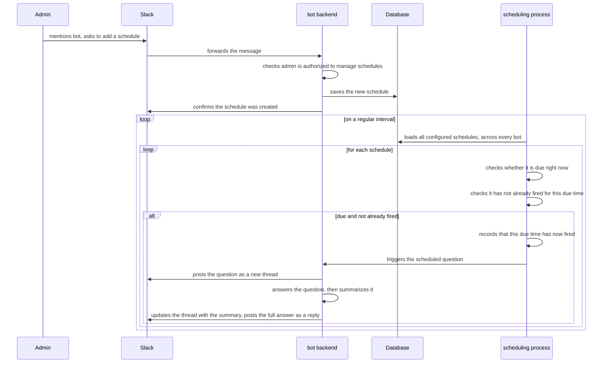
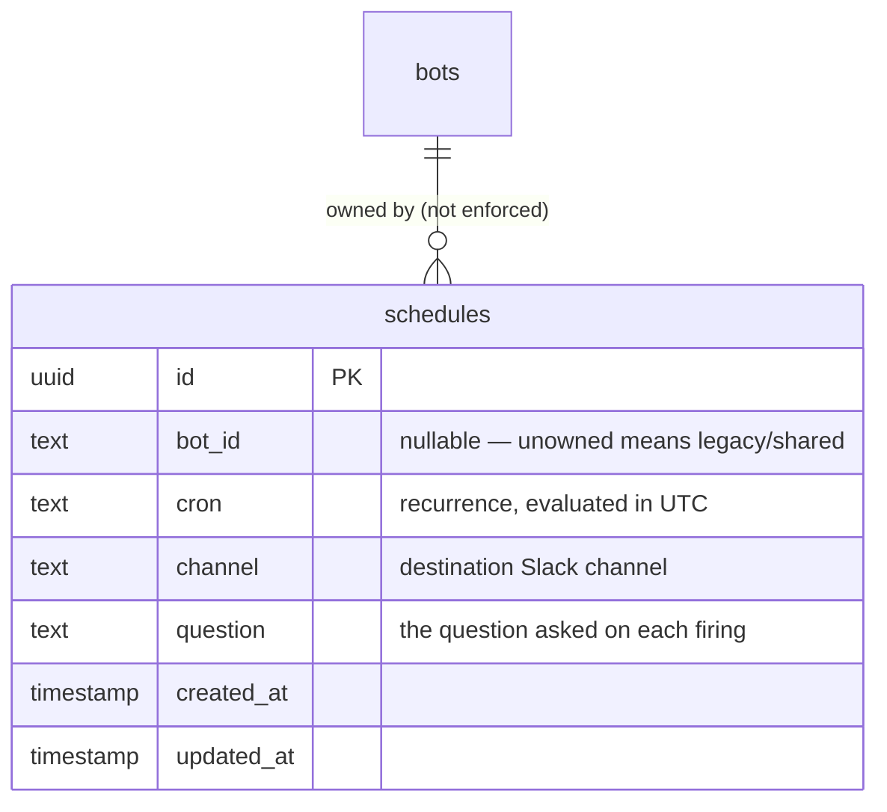

# **Scheduled Reports**

*Cron-based automated questions the bot asks itself and posts to a Slack channel*

| Authors | hung@100xteam.ai |
| --- | --- |
| Status | `ADOPTED` |
| PRD Link | — |
| Slack | #data-nerd |
| Date | 2026-09-12 |

# **Overview**

Scheduled reports let an admin configure the bot to automatically ask itself a question on a recurring cadence and post the answer into a Slack channel — no person has to remember to ask, and no separate reporting tool is needed. A schedule captures a recurrence (in standard cron syntax), a destination channel, and a question. A background process checks these schedules on a regular interval, and when one is due, the bot runs its normal question-answering flow and posts the result as a new thread.

Admins manage schedules the same way they ask any other question — by mentioning the bot and asking it in natural language (e.g. "add a schedule for every weekday at 9am asking about failed jobs," or "remove schedule X") — there is no separate UI or command surface; scheduling is just another capability the bot understands.

This document describes the current implementation: how the bot decides a schedule is due, how duplicate firings are prevented, and how a firing schedule turns into a posted Slack thread.

# **Business Impact**

- Removes the need for someone to manually re-ask the same question every day or week — recurring reports (job failures, billing summaries, etc.) run themselves.
- Schedule management is self-service through the same chat interface as everything else — no dashboard, ticket, or deploy needed to add, change, or remove a recurring report.
- Works per-bot: each bot's own admins manage that bot's schedules, and schedules run through whichever bot owns them, so different teams or workspaces don't need a shared scheduling surface.

# **Goals**

- Let an admin schedule any question the bot can already answer to repeat on a recurring cadence, posted to a chosen Slack channel.
- Keep schedule management restricted to designated admins, using the same authorization the bot already applies elsewhere — no new permission system.
- Run reliably: no missed firings beyond one polling cycle, and no duplicate firings for the same due time.
- Support multiple bots without requiring every schedule to explicitly declare an owner — older, unowned schedules should keep running.

# **Requirements**

- Recurrence is expressed in standard cron syntax, evaluated in UTC; an invalid expression must be skipped and logged, not crash the polling process.
- A schedule is considered due if its most recent expected firing time falls within the current polling window — this must tolerate the polling cadence itself without firing early or being permanently missed.
- A given due time must fire at most once, even if the process checks multiple times before the next expected firing — this dedup must survive a process restart, not just live in memory.
- A transient failure reading schedules must not crash the polling loop; it should log and retry on the next cycle.
- Only designated admins may list, add, update, or remove schedules; anyone else gets a fixed refusal, not partial results.
- A scheduled question must run through the exact same question-answering flow (same knowledge, same data access) as an interactive question — no separate, narrower code path for what a schedule is allowed to ask.
- A firing schedule must post as its own new thread rather than append to an old one, since a recurring report has no natural "parent" conversation to attach to.

# Solution

## High-Level Flow

## Schedule Management

- Listing, adding, updating, and removing schedules are handled the same way as any other question the bot understands — an admin simply asks in plain language.
- Only users on a bot's admin list can perform these actions; anyone else receives a fixed refusal rather than a partial or misleading result.
- Today, update and remove operate on a schedule's unique identifier only, without also checking which bot originally created it — so any admin of any bot can modify or delete any schedule if they know (or guess) its identifier. This is worth revisiting as more bots and admin groups are onboarded (see Discussions).

## Firing Logic

- A single background process polls on a fixed interval (on the order of a few minutes) and, each cycle, loads every configured schedule across every bot in one pass.
- For each schedule, it checks whether the schedule's most recent expected firing time falls within the current polling window — a schedule can only be caught by the cycle immediately following its due time, not an arbitrarily later one.
- To avoid firing the same due time twice, the process keeps a short-lived marker (expiring after about a day) recording the last time each schedule fired. A schedule is only fired if no such marker exists for its current due time.
- Schedules created before the bot supported being pointed at a specific channel/bot combination fall back to running under a default bot identity — this only works if a bot with that exact identity still exists and is active (see Discussions).

## Posting the Result

When a schedule fires:

1. The bot immediately posts the question itself as a new thread — this reserves a place for the conversation and means a person can reply in that same thread afterward to ask follow-ups.
2. The bot answers the question using its normal reasoning and data-access capabilities, then produces a short summary.
3. The thread is updated to show the summary, and the full, detailed answer is posted as a reply underneath it.

# **Database Schema**

| Field | Description |
| --- | --- |
| id | Unique identifier for the schedule |
| bot_id | The bot that owns this schedule; may be empty for schedules created before multi-bot support, which run under a default bot instead |
| cron | The recurrence expression (5-field, UTC) |
| channel | The Slack channel the scheduled question posts into |
| question | The question text sent on each firing |
| created_at / updated_at | Standard record timestamps |

Note the bot relationship is not enforced by the database — nothing today prevents a schedule from pointing at a bot identity that doesn't exist.

# **External Systems Touched**

- **Slack**: posting the initial thread, updating it with the summary, and posting the full answer as a reply.
- **A short-lived cache**: used purely to prevent double-firing within the same due window; it holds no durable record of history — if it were ever cleared, an in-progress firing window could double-fire before the next due time.

# **Rollout Plan**

Already adopted and in production use. A new schedule requires no deploy — an admin adds it conversationally, and it's picked up automatically on the scheduling process's next polling cycle.

# **Discussions**

- List/update/remove are not scoped to the bot that created a schedule — an admin of any one bot can see, edit, or delete every bot's schedules by identifier. Worth revisiting once more than one bot has active schedules with genuinely separate admin groups.
- The "default bot" fallback for older, unowned schedules is a soft dependency — it silently stops working if that specific bot identity is ever removed or deactivated, with no explicit alert.
- The bot-ownership relationship on a schedule isn't enforced at the database level (unlike some of the other tables in this system), so a typo'd or stale owner reference isn't caught until the schedule is actually due to fire.
- The double-fire guard is keyed off the schedule's content (its recurrence, channel, and question text) rather than its identifier — two distinct schedules that happen to share all three values could suppress each other's firing. Not observed in practice, but worth tightening if it becomes a real scenario.
- A scheduled question runs without an attached user identity, so it can never itself trigger anything that requires personal authorization (like requesting data access or managing schedules) — only read-oriented, informational questions are realistically answerable through this path today.
