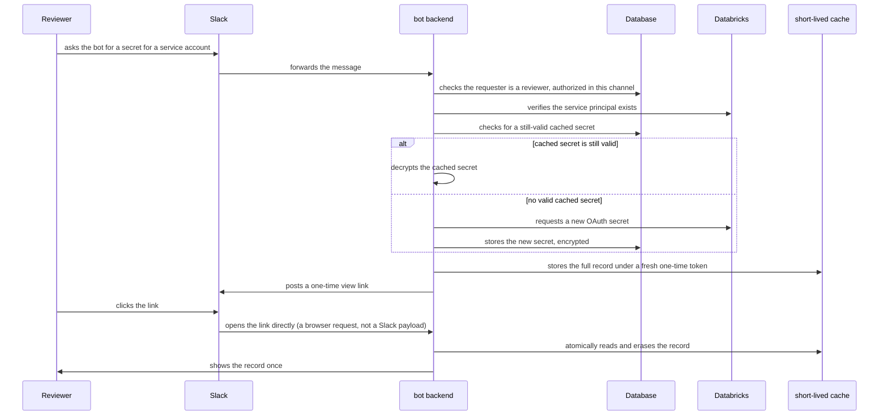
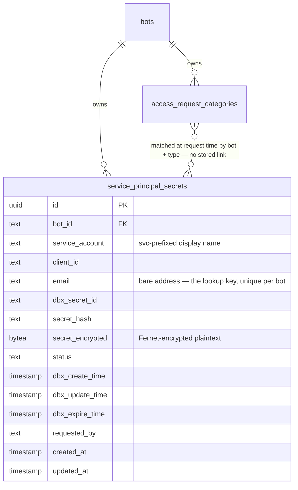

# **Service Principal Secret Generation**

*Reviewer-gated generation of Databricks service-principal OAuth secrets, handed off via a one-time view link instead of posted in Slack*

| Authors | hung@100xteam.ai |
| --- | --- |
| Status | `ADOPTED` |
| PRD Link | — |
| Slack | #data-nerd |
| Date | 2026-09-13 |

# **Overview**

Reviewers can ask the bot to generate a Databricks service-principal OAuth client secret directly from a Slack conversation, without going into the Databricks UI or filing a ticket. Unlike the data access request flow, this is a single, synchronous step — no form, no separate approver: the requester themselves must already be a configured reviewer, checked before anything else happens. The bot verifies the service principal exists, reuses a still-valid previously generated secret if one is cached, or mints a new one and caches it, then hands the result back through a one-time view link rather than posting it as plaintext in the channel.

This document describes the current implementation: the eligibility check, why the secret has to be cached at all, and the one-time hand-off mechanism that stands in for a third-party "burn after reading" service.

# **Business Impact**

- Removes the manual Databricks-console workflow for issuing a service-principal secret — a reviewer gets one from the same Slack conversation they already use for everything else.
- Never exposes a live credential as plaintext in Slack's own message history, where it would otherwise sit indefinitely, readable by anyone with channel access or export/audit tooling.
- Avoids unnecessary secret churn: Databricks caps how many active secrets a service principal can hold, so reusing a still-valid one (instead of minting a new one on every request) keeps the bot from silently exhausting that budget.

# **Goals**

- Let a configured reviewer generate a Databricks service-principal OAuth secret for a given service account, entirely from Slack.
- Restrict this strictly to reviewers, per bot/channel, reusing the same eligibility mechanism as data access requests rather than inventing a second one.
- Never let the secret's plaintext value land in a Slack message or the bot's own conversation history.
- Return the existing secret if it's still valid, rather than rotating it on every request.

# **Requirements**

- The requester must already be listed as a reviewer for this request type in the channel they asked in — checked before any Databricks or database call, so an ineligible request has no side effects at all.
- Databricks only ever returns a secret's plaintext once, at the moment it's created — never again on any later lookup. Honoring "return it if still valid" is only possible by caching that plaintext ourselves, encrypted at rest.
- The hand-off link must work exactly once: a reload, a second person with the link, or two requests racing each other must never both see the secret.
- The service account is identified the same way the rest of the bot already identifies service principals — by its bare email address, not its Databricks-internal display name.
- A cache hit must still produce a brand-new, single-use link — never a reused or previously-issued one.

# Solution

## High-Level Flow

## Entry Point — Requesting a Secret

- A reviewer asks the bot for a secret in a Slack thread; the bot recognizes this as a secret-generation request and resolves the service account from the message.
- Eligibility is checked in one step, before anything else: the channel must be authorized for this request type, and the requester must be on that request type's reviewer list. Either failure produces a plain refusal with no Databricks or database access at all.
- This deliberately has no second, separate-approver step — unlike a data access request, the requester's own reviewer status is the entire authorization; there's no form and nothing pending afterward.

## Service Principal Lookup

- The service principal is looked up by its bare email address, the same identity convention (and the same lookup function) used elsewhere in the bot for resolving service principals. If none exists, the request is refused before any secret is generated or cached.

## Secret Caching

- Because Databricks only ever returns a secret's plaintext value once — at creation — there is no way to ask it for the value again later. Returning an existing, still-valid secret is only possible because the bot cached that plaintext itself, encrypted, the first time it was generated.
- A cached secret is considered valid only if its recorded status is active and its expiry is still in the future; anything else results in a new secret being requested from Databricks and the cache entry being replaced in place — there is no history kept of secrets that were rotated away.
- The cache is keyed by the owning bot and the service account's bare email, one row per pair.

## One-Time Hand-off

- Whether the secret came from cache or was just minted, the full record — not just the bare secret string, but the same shape Databricks itself returns (identifiers, status, timestamps, and the secret value) — is written into a short-lived cache under a freshly generated, unguessable token, and a link containing that token is posted to Slack.
- A cache hit still gets a brand-new token and link each time; a previously issued link is never reused.
- Opening the link reads and erases the cached record in a single atomic step, so a second open of the same link — a reload, a forwarded link, two people racing each other — always finds nothing. This is the same "opens exactly once" guarantee a third-party burn-after-reading note service would provide, without ever handing the secret to a third party.
- Because this link is opened directly by a person's browser rather than delivered as a Slack payload, there's no Slack signature to check here — unlike everywhere else the bot's always-on webhook layer touches, this one endpoint is deliberately unauthenticated by design, relying entirely on the token being both unguessable and single-use.

# **Database Schema**

| Field | Description |
| --- | --- |
| id | Unique identifier |
| bot_id | Owning bot |
| service_account | Databricks' svc-prefixed display name for the service principal |
| client_id | The service principal's Databricks application/client ID |
| email | The bare address identifying the service principal — the actual lookup key, unique per bot |
| dbx_secret_id | Databricks' own identifier for this secret |
| secret_hash | Databricks' hash of the secret, kept alongside the encrypted value for reference |
| secret_encrypted | The secret's plaintext value, encrypted at rest — never stored or logged unencrypted |
| status | The secret's status as last reported by Databricks (e.g. active) |
| dbx_create_time / dbx_update_time / dbx_expire_time | Timestamps as reported by Databricks at creation |
| requested_by | Slack user who triggered the generation that produced the currently cached secret |
| created_at / updated_at | Standard record timestamps |

Eligibility reuses the existing `access_request_categories` table (a new request type value, not a new table) — the same bot/channel/reviewer mapping that gates data access requests also gates this capability, matched fresh at request time rather than through any stored reference.

# **External Systems Touched**

- **Slack**: posting the one-time link as a plain message (no interactive button — there's no form to fill out).
- **Databricks**: identity lookup for the service principal, and OAuth secret generation against its workspace-level secrets endpoint.
- **A short-lived cache**: holds the one-time hand-off record only; it is not the durable record of the secret (that's the encrypted database row) and holds no history — once a token is read, or its short expiry passes unread, the record is gone for good.

# **Rollout Plan**

Shipped in code, but adopted closed: the seeded eligibility record for this request type starts with no authorized channels and no reviewers, so nothing can use it until an admin explicitly configures both. Enabling it for a bot is a data change only — no deploy required.

# **Discussions**

- Rotating in a new secret doesn't revoke the one it replaces in Databricks — the old secret keeps working until it naturally expires, even though the cache has already moved on to the new one. That may be the right behavior (nothing holding the old secret breaks unexpectedly), but it does mean a "rotate my secret" request doesn't actually invalidate what it's rotating away from.
- The cached status/expiry is never reconciled against Databricks directly — if a secret is revoked out-of-band in Databricks itself, the cache won't know until its recorded expiry is reached, and would keep handing out a secret Databricks itself no longer considers active.
- If the encryption key used to protect cached secrets is ever rotated, every previously cached (and otherwise still-valid) secret becomes permanently undecryptable — there's no re-encryption or fallback path today; the request simply fails rather than transparently minting a fresh one.
- No history is kept of secrets that were rotated away — the cache is a single current row per service account, overwritten in place, so there's no way to look back at what a service account's secret used to be.
- This is the second capability layered onto the `access_request_categories` table, which was originally built for a single purpose (data access requests). Worth revisiting if a third, differently-shaped capability wants to reuse it.
